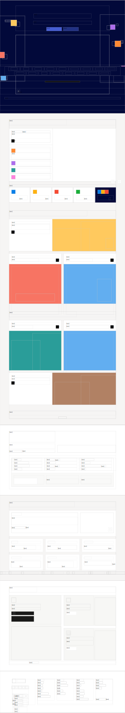

# Notion Architecture
**Productivity and note-taking web application.**

---

## 🎨 UI Identity & Layout Mapping

Minimalist, block-based structural layout emphasizing immense white-space and crisp typography. Driven by a utilitarian, data-first visual hierarchy.

### Geometry Preview

  

## 📂 Structural Blueprints

The geometric coordinates and layout boundaries natively generating this UI skeleton are fully accessible via the isolated sandbox directory!

- **SVG Architecture**: [preview.svg](./pages/homepage/preview.svg) - Visually scalable layout abstraction.
- **JSON Framework**: [page-structure.json](./pages/homepage/page-structure.json) - W3C compatible design boundaries and offsets.
- **Redacted Snapshot**: [full-page.png](./pages/homepage/screenshots/full-page.png) - Visual representation heavily sanitized of copyrighted brand imagery/text.

### Utilization Guide
Integrate this foundational grid inside your own project:
1. Parse the `page-structure.json`.
2. Extract the relative nested positioning logic.
3. Render utilizing `div` block-wrappers mapping specifically to the supplied `bounding-box` integers!

---

> Generated by **PatternVault** on behalf of [The-Neo-Programmer](https://github.com/The-Neo-Programmer).